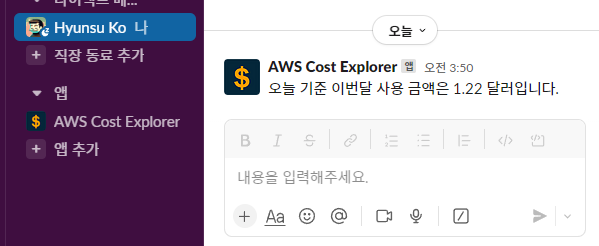

#  AWS-Cost-Explorer-Slack-App



Check Current AWS Costs within Slack (*현재 AWS 요금을 Slack에서 확인*)

> [!CAUTION]
> ARM Architecture not supported yet! If you're a ARM(Mac, RaspberryPi ...) user, please try [Cloud9](https://us-east-1.console.aws.amazon.com/cloud9control/home) to deploy your slack app. (ARM 아키텍처는 아직 지원되지 않습니다. Mac, RaspberryPi 등의 ARM 기기를 사용하신다면 [Cloud9](https://us-east-1.console.aws.amazon.com/cloud9control/home)을 활용하여 slack app을 배포하시기 바랍니다.)

<br/>

# Used
- [Slack Bolt for Python](https://github.com/slackapi/bolt-python)
- [AWS CLI](https://aws.amazon.com/ko/cli/)
- [AWS SAMCLI](https://docs.aws.amazon.com/ko_kr/serverless-application-model/latest/developerguide/install-sam-cli.html#install-sam-cli-instructions)
- [Docker](https://docs.docker.com/engine/install/)

<br/>

# Project Structure
```
📦aws-cost-explorer-slack-app
 ┣ 📂src
 ┃ ┣ 📂listeners
 ┃ ┃ ┣ 📂handlers
 ┃ ┃ ┃ ┗ 📜cost.py
 ┃ ┃ ┗ 📜commands.py
 ┃ ┣ 📜app.py
 ┃ ┗ 📜requirements.txt
 ┣ 📜.gitignore
 ┣ 📜README.md
 ┗ 📜template.yaml
```

<br/>

# Features
#### [🇰🇷 Use Guide](https://hyunsuko.notion.site/AWS-Cost-Explorer-Slack-App-78232e6f536e40dd81acbc2c3329ea08?pvs=4)

- `/cost`
    - **Output the cumulative AWS charges for the current month in $ currency.**
    
      ***현재까지 누적된 이번달 AWS 요금을 $ 단위로 출력합니다.***

<br/>

# Installation
#### [🇰🇷 Installation Guide](https://hyunsuko.notion.site/AWS-Cost-Explorer-Slack-App-78232e6f536e40dd81acbc2c3329ea08?pvs=4)

- Lambda Functions and S3 Buckets are needed to deploy a Slack App.
  
  *Slack App 배포를 위해 Lambda 함수와 S3 버킷이 사용됩니다.*

- Charges may apply based on Lambda/S3 usage in your AWS billing.
  
  *Lambda와 S3 사용량에 따라 AWS 요금이 부과될 수 있습니다.*